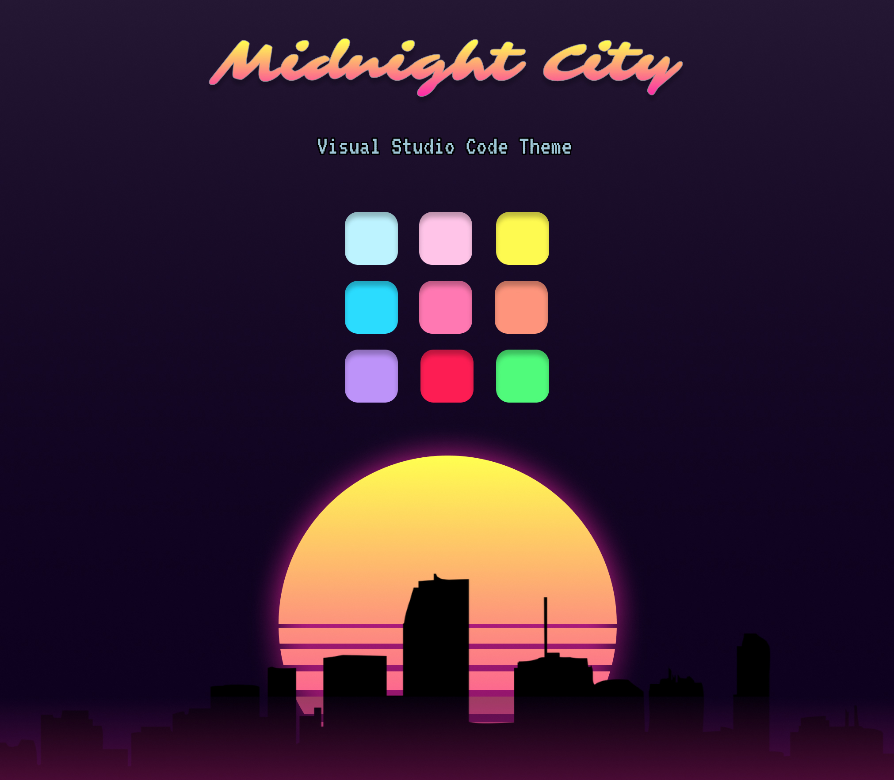
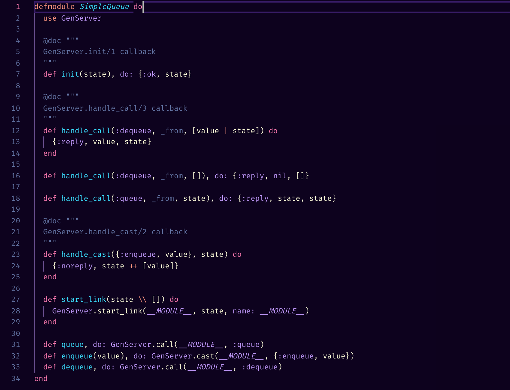
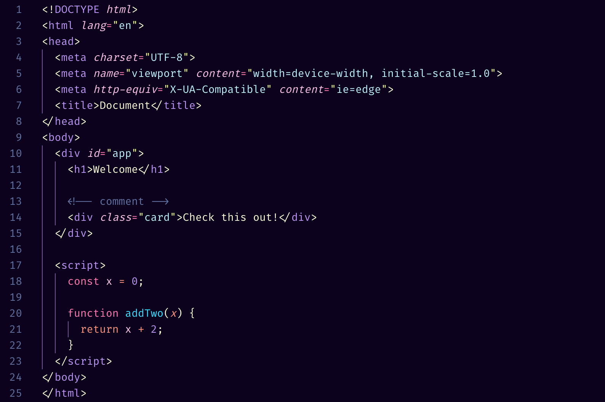

# Midnight City

Midnight City is a dark Visual Studio Code theme inspired by Outrun/Synthwave color vibes.

# Installation

1.  Install [Visual Studio Code](https://code.visualstudio.com/)
2.  Launch Visual Studio Code
3.  Choose **Extensions** from menu
4.  Search for `midnight city`
5.  Click **Install** to install it
6.  Click **Reload** to reload the Code
7.  From the menu bar click: Code > Preferences > Color Theme > **Midnight City**

## Examples

### Elixir

### HTML

### React

## iTerm2

If you want to use Midnight City for your iTerm2 theme [@Electrux](https://github.com/Electrux) created one you can find [here](https://github.com/Electrux/iterm2-midnight-city).

## Contributing & Issues

If something looks off do not hesitate to [open an issue](https://github.com/dillonchanis/theme-midnight-city/issues). And if you find something you want to fix have a look at the [contributing guidelines](https://github.com/dillonchanis/theme-midnight-city/blob/master/.github/CONTRIBUTING.md).  Thanks!
